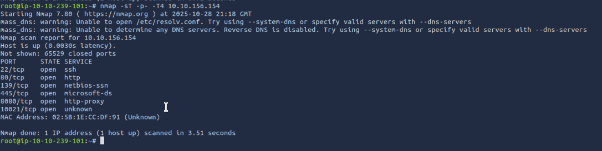

# TryHackMe: [Net Sec Challenge] Write-up

This document outlines the steps taken to complete the [Net Sec Challenge] room on TryHackMe. This medium-difficulty room focuses on enumeration of multiple services, banner grabbing, and simple file access.

## Table of Contents
* [🚀 Scanning & Reconnaissance](#-scanning--reconnaissance)
* [🕵️ Service Enumeration & Flag Hunting](#-service-enumeration--flag-hunting)
  * [Port 80 (HTTP)](#port-80-http)
  * [Port 22 (SSH)](#port-22-ssh)
  * [Port 10021 (FTP)](#port-10021-ftp)
* [💻 Web Challenge (Port 8080)](#-web-challenge-port-8080)
* [🏁 Conclusion](#-conclusion)

---

## 🚀 Scanning & Reconnaissance

We begin with a full TCP port scan using `nmap` to identify all open services.

```bash
nmap -sT -p- 10.10.156.154
```

The scan reveals 6 open TCP ports.




This scan immediately answers the first few questions.

> [!NOTE]
> **Question:** What is the highest port number being open less than 10,000?
> **Answer:** `8080`

> [!NOTE]
> **Question:** There is an open port outside the common 1000 ports; it is above 10,000. What is it?
> **Answer:** `10021`

> [!NOTE]
> **Question:** How many TCP ports are open?
> **Answer:** `6`

---

## 🕵️ Service Enumeration & Flag Hunting

With the open ports identified, we can enumerate each service for more information and potential flags.

### Port 80 (HTTP)

A simple `curl` command with the `-I` flag can be used to pull the HTTP headers from the web server.

```bash
curl -I http://10.10.156.154 http://10.10.156.154
```

The server response includes a flag directly in the `Flag` header.

![[http-header 1.png]]
> [!NOTE]
> **Question:** What is the flag hidden in the HTTP server header?
> **Answer:** `THM{web_server_25352}`

### Port 22 (SSH)

We can grab the SSH banner using `telnet` (or `nc`) to connect to the port. The SSH server often identifies itself immediately upon connection.

```bash
telnet 10.10.156.154 22
```

The banner is displayed, containing another flag.

![[ssh-header 1.png]]
> [!SUCCESS]
> **Question:** What is the flag hidden in the SSH server header?
> **Answer:** `THM{946219583339}`

### Port 10021 (FTP)

The Nmap scan listed this port as "unknown." We can run a targeted version scan (`-sV`) on this specific port to identify the service.

```bash
nmap -sV -p 10021 10.10.156.154
```
![[ftp version uknown port.png]]
``Nmap correctly identifies the service as vsftpd 3.0.5.``

> [!success]
> **Question:** We have an FTP server listening on a nonstandard port. What is the version of the FTP server?
> **Answer:** `vsftpd 3.0.5`

---

#### Brute-forcing FTP Logins

The `nmap` scan identified `vsftpd 3.0.5`. The room briefing also gave us two potential usernames: `eddie` and `quinn`. We can use a tool like **Hydra** to brute-force the passwords for both usernames against the FTP service on port `10021`.


```bash
hydra -l <username> -P /usr/share/wordlists/rockyou.txt -s 10021 10.10.156.154 ftp
```

---

#### 🐇 The 'eddie' Rabbit Hole

First, we attempt to find the password for the user `eddie`.


```bash
hydra -l eddie -P /usr/share/wordlists/rockyou.txt -s 10021 10.10.156.154 ftp
```

Hydra quickly finds a valid password: `jordan`.

We log in using these credentials (`eddie`:`jordan`).

![[ftp hydra rabbit-hole eddie.png]]

Despite a successful login, a thorough search of the directories reveals no flag. This is a common CTF "rabbit hole" designed to waste time.

---

#### 🚩 Finding the Flag with 'quinn'

Since the `eddie` account was a dead end, we repeat the brute-force attack, this time targeting the user `quinn`.


```bash
hydra -l quinn -P /usr/share/wordlists/rockyou.txt -s 10021 10.10.156.154 ftp
```
![[flag.txt found using hydra to bruteforce quinn 1.png]]

Hydra finds another password: `andrea`. We log in with this new set of credentials (`quinn`:`andrea`).

This time, listing the files with `ls -a` reveals `ftp_flag.txt`. We download it using `get` and then read it on our local machine.


> [!SUCCESS] 
> **Question:** We learned two usernames using social engineering: eddie and quinn. What is the 
> flag hidden in one of these two account files and accessible via FTP? **Answer:** >
> `THM{321452667098}`

---

## 💻 Web Challenge (Port 8080)

Finally, we browse to the web server running on port `8080`. **Note:** The screenshots confirm this challenge is on a different IP: `http://10.10.174.89:8080`.
![[the counter 1.png]]
The page presents a challenge: use `nmap` to scan the machine as covertly as possible to avoid being detected by the IDS.

A "loud" scan, like a default `nmap -sT` (TCP Connect scan), will be immediately detected by the IDS, and the page will update to show a 100% detection chance.
![[100% by ids 1.png]]
To solve this, we must use a null scan. A **Null scan** sends TCP packets with **no flags set** (all flag bits = 0). Closed ports typically reply with an RST while open or filtered ports often give **no response**, so tools like `nmap -sN` report those as `open|filtered`. 


```bash
nmap -sN 10.10.174.89
```
![[the flag.png]]
After running a successful null scan, the page updates to show the challenge is complete and displays the final flag.


> [!SUCCESS] 
> **Question:** Browsing to http://[IP]:8080 displays a small challenge that will give you a flag once
> you solve it. What is the flag? **Answer:** `THM{f7443f99}`

---

## 🏁 Conclusion

This room was a fantastic exercise in methodical enumeration and critical thinking. The key takeaways were:

- **Scan Everywhere:** Always run a full port scan (`-p-`) to find services on non-standard ports.
    
- **Check Banners:** Never underestimate the information leaked in service banners (`ssh`, `ftp`, `http` headers).
    
- **Beware of Rabbit Holes:** The `eddie` user was a well-placed distraction. If one path doesn't yield results, pivot and try other leads (like the `quinn` user).
    
- **Know Your Tools:** Understanding the difference between Nmap scan types  was crucial for the final challenge, and `hydra` was essential for gaining access.